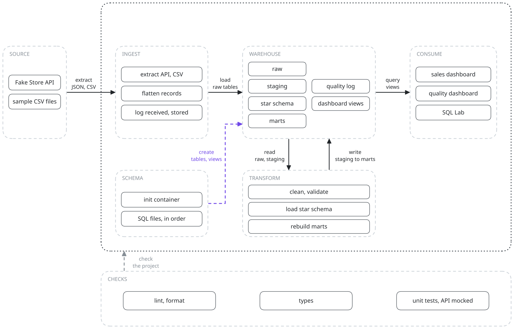
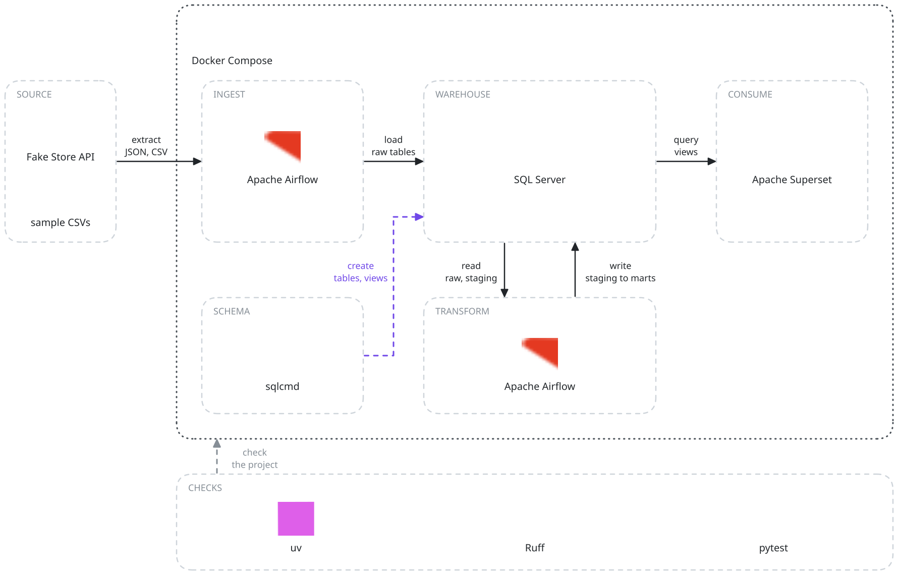

# Microsoft Data Stack

A containerized data engineering solution demonstrating end-to-end data pipeline capabilities: ingestion from multiple sources, multi-layer data warehouse architecture, and quality monitoring dashboards.

## Architecture



## Tech Stack



| Component | Technology |
|-----------|------------|
| Database | SQL Server 2022 |
| Orchestration | Apache Airflow 2.8 |
| Visualization | Apache Superset 3.1 |
| Data Processing | Python (pandas, requests) |
| Infrastructure | Docker Compose |

## Getting Started

### Prerequisites

- Docker Desktop 4.0+
- Docker Compose 2.0+
- 8GB RAM available for containers

### Setup

1. **Clone the repository**
   ```bash
   git clone <repository-url>
   cd microsoft_data_stack
   ```

2. **Create environment file**
   ```bash
   cp .env.example .env
   # Edit .env to customize passwords if needed
   ```

3. **Start the stack**
   ```bash
   docker compose up -d
   ```

4. **Wait for initialization** (~2-3 minutes)
   ```bash
   # Check container status
   docker compose ps

   # View logs
   docker compose logs -f sqlserver-init
   ```

### Access Points

| Service | URL | Credentials |
|---------|-----|-------------|
| Airflow | http://localhost:8080 | admin / admin |
| Superset | http://localhost:8088 | admin / admin |
| SQL Server | localhost:1433 | sa / (from .env) |

## Project Structure

```
microsoft_data_stack/
├── docker-compose.yml      # Container orchestration
├── .env.example            # Environment template
├── SPEC.md                 # Detailed specification
│
├── airflow/
│   ├── Dockerfile
│   ├── requirements.txt
│   └── dags/               # Pipeline definitions
│
├── superset/
│   ├── Dockerfile
│   └── superset_init.sh
│
├── sql/
│   ├── 01_create_schemas.sql
│   ├── 02_raw_tables.sql
│   ├── 03_staging_tables.sql
│   ├── 04_dw_tables.sql
│   ├── 05_mart_tables.sql
│   └── 06_quality_tables.sql
│
├── src/
│   ├── connectors/         # Data source connectors
│   ├── loaders/            # Data loading logic
│   ├── transformers/       # Data transformation
│   └── quality/            # Quality tracking
│
└── data/
    ├── sample/             # Sample data files
    └── raw/                # Landing zone (git-ignored)
```

## Data Layers

| Layer | Schema | Purpose |
|-------|--------|---------|
| Raw | `raw.*` | Landing zone, data preserved as-is |
| Staging | `staging.*` | Cleaned, validated, typed data |
| Warehouse | `dw.*` | Star schema (dimensions + facts) |
| Marts | `mart.*` | Pre-aggregated analytics views |
| Quality | `quality.*` | Pipeline metrics and audit logs |

## Running the Pipelines

### 1. Start the Stack
```bash
docker compose up -d
```

### 2. Run Ingestion Pipeline
1. Open Airflow: http://localhost:8080
2. Enable and trigger `data_ingestion` DAG
3. Wait for completion (~1 min)

### 3. Run Transformation Pipeline
1. Enable and trigger `data_transformation` DAG
2. Wait for completion (~1 min)

### 4. View Dashboards
1. Open Superset: http://localhost:8088
2. Navigate to **SQL Lab** to explore data
3. Create dashboards using pre-built views (see below)

## Dashboards

Two dashboards are available:

### Sales Analytics Dashboard
- Revenue, Orders, Customer KPIs
- Daily sales trend
- Sales by category
- Top products by revenue
- Customer segments

### Data Quality Dashboard
- Overall quality score
- Records received vs stored
- Quality trend over time
- Pipeline run status

See [superset/dashboards/DASHBOARD_SETUP.md](./superset/dashboards/DASHBOARD_SETUP.md) for detailed setup instructions.

### Pre-built Dashboard Views
```sql
-- Sales views
SELECT * FROM dw.vw_sales_kpi_summary;
SELECT * FROM dw.vw_daily_sales_trend;
SELECT * FROM dw.vw_sales_by_category;
SELECT * FROM dw.vw_top_products;

-- Quality views
SELECT * FROM quality.vw_quality_summary;
SELECT * FROM quality.vw_quality_by_source;
```

## Data Quality Tracking

Every pipeline run logs:
- **Records Received**: Count extracted from source
- **Records Stored**: Count successfully loaded
- **Records Rejected**: Count failed validation
- **Quality Score**: `(stored / received) × 100`

Query the quality metrics:
```sql
SELECT
    source_name,
    records_received,
    records_stored,
    quality_score,
    created_at
FROM quality.ingestion_log
ORDER BY created_at DESC;
```

## Common Commands

```bash
# Start all services
docker compose up -d

# Stop all services
docker compose down

# View logs
docker compose logs -f <service-name>

# Restart a specific service
docker compose restart airflow-webserver

# Reset everything (delete volumes)
docker compose down -v

# Connect to SQL Server
docker exec -it mds_sqlserver /opt/mssql-tools18/bin/sqlcmd \
    -S localhost -U sa -P 'YourStrong@Passw0rd123' -C
```

## Troubleshooting

### SQL Server won't start
- Ensure you have at least 2GB RAM allocated to Docker
- Check the password meets SQL Server complexity requirements

### Airflow tasks failing
```bash
# Check scheduler logs
docker compose logs airflow-scheduler

# Verify SQL Server connection
docker exec mds_airflow_webserver python -c "
from airflow.providers.microsoft.mssql.hooks.mssql import MsSqlHook
hook = MsSqlHook(mssql_conn_id='mssql_default')
print(hook.get_conn())
"
```

### Superset can't connect to SQL Server
- Verify SQL Server is healthy: `docker compose ps`
- Check connection string in Superset uses `sqlserver` as hostname (not `localhost`)

## Next Steps

See [SPEC.md](./SPEC.md) for:
- Detailed architecture diagrams
- Star schema design
- Implementation phases
- Sample queries
